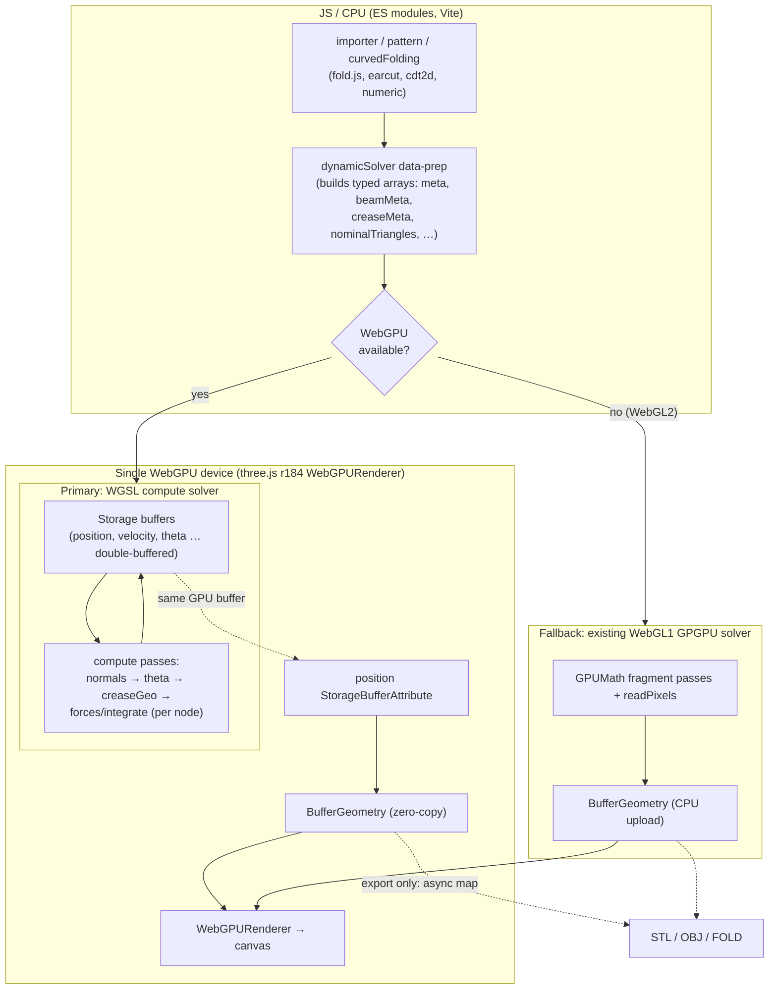

# Origami Simulator — WebGL → WebGPU Migration Plan

**Status:** Proposal / evaluation
**Scope decided with maintainer:** Full modernization (ES modules + bundler, modern three.js, WebGPU end‑to‑end, eliminate the per‑frame CPU readback) · solver implemented as **WGSL compute shaders** · **retain a WebGL fallback** for browsers without WebGPU.
**Date:** 2026‑06

---

## 1. Executive summary

The app contains **two independent "WebGL" layers**, and the conversion is really two projects:

| Layer | What it is today | Files | Conversion |
| --- | --- | --- | --- |
| **A. GPGPU physics solver** | A hand‑written WebGL **1** general‑purpose‑GPU engine that stores simulation state in `RGBA FLOAT` textures and runs the fold solver as fragment‑shader passes with ping‑pong framebuffers. This is the novel core from the 7OSME paper. | `js/dynamic/GPUMath.js`, `js/dynamic/GLBoilerplate.js`, 13 GLSL shaders embedded in `index.html` (lines 37–744), `js/dynamic/dynamicSolver.js` | Rewrite as **WGSL compute kernels** over storage buffers. WebGPU‑only; the existing WebGL solver is kept as the **fallback**. |
| **B. Renderer** | **three.js r87** (2017) `WebGLRenderer` with `TrackballControls`, lights, `BufferGeometry`. | `js/threeView.js`, `js/model.js`, `dependencies/three*.js` | Upgrade to **three.js r184+ `WebGPURenderer`** (`three/webgpu`), which renders on WebGPU and **auto‑falls back to WebGL2**. |

The two layers do **not** share GPU memory today. Each frame the solver runs ~100 iterations, then performs a **synchronous `gl.readPixels`** to copy node positions to the CPU, which are then uploaded into the three.js `BufferGeometry`. The headline performance win of WebGPU here is to **keep simulation state on the GPU and feed it directly into the render geometry**, deleting that round trip.

### Recommendation
Execute in **5 phases**, each independently shippable and individually reversible. Build a **numeric regression harness first** (Phase 0) so every later change can be validated against the current WebGL output. Treat the three.js upgrade (Phase 1) and the compute‑solver rewrite (Phase 2) as separate, sequenced efforts — they fail for different reasons and must be debuggable in isolation.

---

## 2. Current architecture (evaluation)

### 2.1 The GPGPU solver

`initGPUMath()` (`js/dynamic/GPUMath.js`) creates a dedicated `<canvas id="gpuMathCanvas">` WebGL1 context, requires the `OES_texture_float` extension, and exposes a tiny framework:

- `createProgram(name, vs, fs)` — compiles a fragment program; every program shares one full‑screen‑quad vertex shader and a `[-1,-1, 1,-1, -1,1, 1,1]` triangle‑strip (`GLBoilerplate.loadVertexData`).
- `initTextureFromData(name, w, h, type, data)` — uploads a `Float32Array` as an `RGBA`/`FLOAT` texture (`GLBoilerplate.makeTexture`, `NEAREST`, `CLAMP_TO_EDGE`).
- `initFrameBufferForTexture(name)` — render‑to‑texture target.
- `step(program, inputs[], output)` — binds the output FBO, binds input textures to units, `drawArrays(TRIANGLE_STRIP, 0, 4)`.
- `swapTextures` / `swap3Textures` — ping‑pong by swapping texture + framebuffer handles.
- `readPixels` — **synchronous** readback (only `UNSIGNED_BYTE` is portable in WebGL1).

State is laid out as square textures sized to the next power of two (`calcTextureSize`): one texel per node / edge / crease / face, with `RGBA` carrying up to 4 floats. 1‑D array semantics are emulated in‑shader with `mod`/`floor` over `u_textureDim`.

`dynamicSolver.js` builds all the typed arrays (`originalPosition`, `mass`, `meta`/`meta2` indirection tables, `beamMeta`, `creaseMeta`/`creaseMeta2`, `nodeCreaseMeta`, `nodeFaceMeta`, `nominalTriangles`, `theta`, `normals`, …) and drives one `solveStep()`:

```
normalCalc        (per face)   → u_normals
thetaCalc         (per crease) → u_theta            (dihedral angle, unwrapped)
updateCreaseGeo   (per crease) → u_creaseGeo        (moment arms / coefficients)
velocityCalc | positionCalcVerlet   (per node)      → forces → integrate
positionCalc | velocityCalcVerlet   (per node)
swapTextures(theta/velocity/position …)
```

`solve(numSteps)` loops `solveStep()` **`numSteps` (default 100)** times, then `render()` runs **`packToBytes`** — a GLSL routine that bit‑encodes each float into 4 bytes (`encode_float`) purely because WebGL1 cannot read back float textures — `readPixels` the bytes, reinterprets them as `Float32Array`, adds each node's `_originalPosition`, writes into the shared `positions` array, optionally derives the strain color (`setHSL`), and prints global error.

**WebGL1‑specific things that will *not* map 1:1:**

1. **`packToBytes`/`encode_float`** exists only to defeat WebGL1's lack of float readback. **On WebGPU it is deleted** — `GPUBuffer.mapAsync` reads `f32` directly.
2. **`mediump float`** precision. WebGPU is `f32` throughout (an upgrade, but a source of small numeric differences vs. today).
3. **Texture‑as‑array `mod`/`floor` indexing.** In compute this becomes plain linear indexing by `global_invocation_id`.
4. **The `for (j=0;j<100;j++){ if (j>=N) break; }` hack** — a hard cap of 100 beams/creases/faces per node forced by GLSL's constant loop bounds. **WGSL allows dynamic loop bounds, so this cap is removed** (a real functional improvement — currently a node touching >100 elements is silently truncated).
5. **Two separate GL contexts** (`gpuMathCanvas` + the three.js canvas) communicating over the CPU. On the modern path these collapse into **one WebGPU device** shared by renderer and compute.

CPU→GPU sync points (must be preserved): `originalPosition`, `mass` (fixed flags), `externalForces`, `creaseMeta` (stiffness), `beamMeta` (materials + `dt` recompute), `lastPosition` (node dragging), and the `u_creasePercent` / `u_dt` uniforms.

### 2.2 The renderer

`threeView.js` instantiates `THREE.WebGLRenderer({antialias:true})`, a `PerspectiveCamera`, six `DirectionalLight`s, `TrackballControls` (from `dependencies/`), and drives the loop with `renderer.animate(_loop)`. `model.js` builds a `BufferGeometry` with `addAttribute('position'|'color')`, front/back `MeshPhongMaterial`s, and edge `LineSegments`; each step sets `geometry.attributes.position.needsUpdate = true`.

**three.js r87 → r184 API debt (rendering only):**

- `renderer.animate` → `renderer.setAnimationLoop`
- `geometry.addAttribute` → `geometry.setAttribute`; `geometry.dynamic` removed
- `TrackballControls`, `OBJExporter`, `STLExporter`, `SVGLoader` move to `three/addons/…`
- **Color management** (r152+): textures/colors default to `SRGBColorSpace`, `renderer.outputColorSpace`; backgrounds and material colors will shift unless updated.
- **Lighting** (r155+): physically‑correct lighting is the default; the six hand‑placed directional lights and material params must be re‑tuned or `useLegacyLights` emulated.
- `vertexColors: true` (boolean) replaces the old enum.
- **WebVR** (`WebVR.js`, `VRController.js`, `datguivr`) is dead — must be removed or re‑implemented on **WebXR**. README already flags VR as "may be deprecated"; recommend removing it from the critical path.

### 2.3 Build & dependencies

No bundler — plain `<script>` tags and globals (`globals`, `THREE`, `$`, `_`). Pure‑JS deps unaffected by the GPU work: `fold.js`, `earcut`, `cdt2d`, `svgpath`, `path-data-polyfill`, `numeric.js` (static solver / curved folding), `FileSaver`, `CCapture` (GIF/WebM export), jQuery + jQuery‑UI + flat‑UI (DOM UI). The `staticSolver` and `rigidSolver` are present but **disabled** in `globals.js` init; only the **dynamic** solver matters for this migration. Note `model.js` already routes through a `getSolver()` switch — the natural seam to slot a WebGPU solver behind.

---

## 3. Target architecture



Key properties:

- **One renderer, two backends.** `import * as THREE from 'three/webgpu'`; `new THREE.WebGPURenderer()` uses WebGPU when present and **automatically falls back to WebGL2**. The render code path is single‑source.
- **Two solvers, one data‑prep.** The expensive part of `dynamicSolver.js` — turning the FOLD model into packed arrays + indirection tables — is **shared**. Only the GPU execution differs:
  - **WebGPU backend** → new compute solver (storage buffers, WGSL).
  - **WebGL2 fallback** → the **existing** WebGL1 fragment solver, unchanged, because *compute shaders and `StorageBufferAttribute` do not run on three.js's WebGL2 backend* (confirmed limitation, see §4.1).
- **No per‑frame readback on the WebGPU path.** The `position` storage buffer **is** the geometry's position attribute (`StorageBufferAttribute`), so the renderer reads solver output directly. Strain color is written to a `color` storage buffer consumed by the material. Readback happens **only on demand** (export, and the global‑error % display) via async `mapAsync`.
- **The float‑encode hack and the second canvas are gone** on the WebGPU path.

---

## 4. Key technical challenges & decisions

### 4.1 The fallback gap (the central constraint)
three.js `WebGPURenderer` falls back to WebGL2 for **rendering**, but **compute** (`renderer.compute*`, `StorageBufferAttribute`, `storage()`) is **WebGPU‑only** — WebGL2 has no compute stage. Therefore "keep a WebGL fallback" cannot mean "run the same TSL compute on WebGL2." Decision: **retain the current WebGL1 GPGPU solver verbatim as the fallback**, selected at runtime by backend detection. This is why the data‑prep layer must be cleanly separated so it can feed either engine. (An alternative — re‑expressing the solver as TSL *fragment/render‑to‑texture* GPGPU that compiles to both WGSL and GLSL — was rejected per the chosen "compute shaders" approach; it remains a fallback option if maintaining the legacy WebGL solver proves too costly.)

### 4.2 Zero‑copy position buffer ↔ geometry
The solver currently stores **displacement** from `originalPosition`; `render()` adds `originalPosition` on the CPU. For zero‑copy rendering we either (a) store **absolute** positions in the render buffer, or (b) keep displacements and add `originalPosition` in a small TSL **vertex node** on the material. Decision: **(b)** — keep the solver math identical (displacement‑based, matches the fallback and the paper), and add `originalPosition` at draw time via a positionNode. The solver's pow2 padding (`textureDim²`) is dropped on the WebGPU path; buffers are length `numNodes` (compute dispatch handles the remainder with a bounds check).

### 4.3 Indexing & dispatch
Replace 2‑D texture coordinates with 1‑D `global_invocation_id.x`. Each kernel dispatches `ceil(count / workgroupSize)` workgroups (start with `workgroupSize = 64`, tune later) over the relevant count (nodes / edges / creases / faces). First line of every kernel: `if (id.x >= count) { return; }`. The `meta`/`meta2`/`beamMeta`/`nodeCreaseMeta`/`nodeFaceMeta` indirection tables carry over unchanged as storage buffers; the `mod`/`floor` address arithmetic disappears.

### 4.4 Ping‑pong without `swapTextures`
`position/lastPosition/lastLastPosition`, `velocity/lastVelocity`, and `theta/lastTheta` are double‑buffered. In WebGPU, allocate read/write buffer pairs and **swap the bound resources** each `solveStep()` (swap bind groups or swap buffer references in the per‑pass uniform). Pass ordering (normals → theta → creaseGeo → integrate) is preserved by issuing the kernels as ordered `renderer.compute()` calls; WebGPU guarantees execution order within the queue, and each kernel reads the previous kernel's output buffer.

### 4.5 Global error / strain reduction
Today `render()` sums per‑node error on the CPU during readback. On the WebGPU path, either (a) run an occasional **parallel reduction** compute kernel and read back a single float a few times per second, or (b) skip the live % unless the panel is open. Decision: **(a)** with throttling — keep the existing UI, but decouple it from the per‑frame path so the hot loop stays readback‑free.

### 4.6 Numerical parity
`mediump` → `f32`, dynamic loop bounds (no 100 cap), and a different reduction order **will** produce small differences. Define acceptance as: identical qualitative fold, and per‑node position deltas within a tolerance (e.g. `< 1e‑3` of model scale) versus the WebGL build at matched fold percentages on the regression set. The removed 100‑element cap may *intentionally* diverge on dense patterns — document those as expected improvements.

### 4.7 three.js upgrade churn
Color management, physically‑correct lighting, `setAttribute`, controls/exporters moving to addons, `setAnimationLoop`. Sequenced as its own phase so visual regressions are attributable to the upgrade, not the solver.

### 4.8 Async export
STL/OBJ/FOLD export and any "save current state" must `await` a buffer map on the WebGPU path. Wrap position access in an `async getPositions()` that maps on WebGPU and returns the CPU array directly on the fallback.

---

## 5. Phased migration plan

### Phase 0 — Foundations & regression harness *(no behavior change)*
**Goal:** make the project buildable as modules and verifiable.
- Add `package.json`, **Vite** dev/build, npm scripts; vendor current libraries; serve the existing app unchanged through the bundler.
- Incrementally convert IIFE/global files (`globals.js`, `model.js`, `threeView.js`, `controls.js`, `dynamicSolver.js`, importers …) to **ES modules**, preserving WebGL behavior.
- Build a **numeric regression harness** (Playwright, headless): load a fixed set of examples (`huffmanWaterbomb`, `crane`, a tessellation, a curved‑fold import), fold to {‑100, 0, 50, 100}%, run N steps, and snapshot node positions + global error to JSON. This is the oracle for every later phase.
**Exit:** identical behavior to `main`; harness produces stable golden snapshots.

### Phase 1 — Renderer modernization (three.js r87 → r184, still rendering)
**Goal:** modern three.js with `WebGPURenderer`, validated on **both** backends, **before** touching the solver.
- Swap to `three`/`three/webgpu` from npm; `new THREE.WebGPURenderer()`.
- Fix API debt: `setAttribute`, `setAnimationLoop`, addons controls/exporters, color management (`outputColorSpace`/`SRGBColorSpace`), re‑tune the six directional lights & `MeshPhongMaterial` for physically‑correct lighting, `vertexColors: true`.
- Decide VR: **remove** WebVR/`datguivr` from the critical path (optionally re‑add WebXR later as a separate effort).
- Keep the **existing WebGL solver** running underneath (still readback‑based) so this phase is purely a render swap.
- Validate via screenshots + the Phase 0 harness on WebGPU and forced‑WebGL2.
**Exit:** pixel‑comparable rendering on both backends; solver untouched.

### Phase 2 — WebGPU compute solver (primary path) *(the bulk of the work)*
**Goal:** replace the GPGPU engine with WGSL compute on the WebGPU backend.
- New module `js/dynamic/WebGPUSolver.js` implementing the same public interface as `dynamicSolver` (`syncNodesAndEdges`, `solve`, `reset`, `render`, `updateFixed`) behind `getSolver()`.
- Refactor `dynamicSolver.js` to extract the **shared data‑prep** (typed‑array + indirection‑table construction) into a backend‑agnostic module consumed by both solvers.
- Port kernels to WGSL/TSL (see Appendix A): `normalCalc`, `thetaCalc`, `updateCreaseGeo`, `velocityCalc`(+verlet), `positionCalc`(+verlet), plus `zero`/`center`/`copy` utilities. **Drop `packToBytes`.**
- Allocate storage buffers (double‑buffer the ping‑pong set); dispatch per count; **remove the 100‑element loop cap**.
- Wire the `position` storage buffer as the geometry `StorageBufferAttribute`; add `originalPosition` in a TSL positionNode (zero readback). Strain → `color` storage buffer → material.
- Throttled reduction kernel for the global‑error display.
- Backend detection selects compute solver vs. legacy solver.
**Exit:** WebGPU build matches WebGL within tolerance (§4.6) on the harness; no per‑frame readback; folds correctly across the example set.

### Phase 3 — Fallback integration & on‑demand readback
**Goal:** make the fallback first‑class and unify export.
- Confirm the legacy WebGL solver runs cleanly under the modern bundler + `WebGPURenderer`'s WebGL2 backend, fed by the shared data‑prep.
- Implement `async getPositions()` (map on WebGPU, direct on WebGL) and route STL/OBJ/FOLD export + "save state" through it.
- Verify CCapture GIF/WebM and PNG export on both paths.
**Exit:** full feature parity (folding, strain viz, drag, import/export, capture) on WebGPU **and** WebGL2.

### Phase 4 — Validation, performance, cleanup
- Full regression sweep across the example library; record numeric deltas and any intentional divergences (cap removal).
- Benchmark steps/sec and max tractable pattern size, WebGPU vs WebGL, small→large.
- Remove dead code superseded on the modern path (the float‑encode hack, second canvas) while keeping the fallback solver intact; update README + this document; document browser support matrix.
**Exit:** documented, benchmarked, shippable.

---

## 6. Risk register

| Risk | Likelihood | Impact | Mitigation |
| --- | --- | --- | --- |
| Compute unavailable on WebGL2 fallback | Certain | High | Two‑solver design; legacy WebGL solver retained (§4.1). |
| Numeric divergence (`mediump`→`f32`, cap removal, reduction order) | High | Medium | Phase 0 oracle + tolerance acceptance (§4.6); document intentional diffs. |
| three.js r87→r184 color/lighting shifts | High | Medium | Isolated Phase 1; re‑tune lights/materials; screenshot diffs on both backends. |
| Async readback breaks synchronous export code | Medium | Medium | `async getPositions()` seam (§4.8); audit all `readPixels`/positions consumers. |
| Zero‑copy buffer↔attribute wiring is finicky in current three.js | Medium | Medium | Prototype `StorageBufferAttribute`→geometry on a toy scene in Phase 2 spike before full port. |
| VR (WebVR) removal regresses a feature | Low | Low | Already deprecated upstream; remove now, optional WebXR later. |
| Mobile / Firefox‑Linux WebGPU gaps | Medium | Low | Fallback covers them; advertise support matrix. |
| Scope/timeline blowout | Medium | Medium | Each phase independently shippable; can stop after Phase 1 (modern renderer, old solver) and still have a working app. |

---

## 7. Testing & validation strategy
- **Numeric oracle (Phase 0):** golden node‑position/error snapshots per example × fold% drive every later comparison.
- **Visual diffs:** Playwright screenshots at fixed camera/fold across backends.
- **Cross‑backend matrix:** run the suite on WebGPU and on `WebGPURenderer` forced to WebGL2, plus the legacy solver path.
- **Feature checklist:** import (SVG/FOLD/drag‑drop), strain viz, node drag/fix, external forces, export (STL/OBJ/FOLD), capture (GIF/WebM/PNG), reset/center.
- **Performance:** steps/sec and largest tractable pattern, recorded before/after.

---

## 8. Effort estimate (single experienced dev)

| Phase | Estimate | Notes |
| --- | --- | --- |
| 0 — Foundations + harness | ~1 week | De‑risks everything; pays for itself. |
| 1 — three.js r87→r184 + WebGPURenderer | ~1.5–2 weeks | API churn, color/lighting re‑tune. |
| 2 — WGSL compute solver | ~3–4 weeks | The hard part: shader correctness, ping‑pong, zero‑copy wiring. |
| 3 — Fallback + async export | ~1 week | Mostly integration. |
| 4 — Validation/perf/cleanup | ~1–2 weeks | |
| **Total** | **~8–10 weeks** | Phases are shippable checkpoints; ranges reflect shader‑debug uncertainty. |

---

## Appendix A — Shader → compute kernel mapping

GLSL fragment shaders live in `index.html`; line numbers are for the current `main`.

| Shader (`index.html`) | Line | Role today | Dispatch (per) | Becomes |
| --- | --- | --- | --- | --- |
| `vertexShader` | 37 | Full‑screen quad for all passes | — | **Deleted** (no full‑screen quad in compute). |
| `packToBytesShader` | 44 | Encode `f32`→4×`u8` for WebGL1 readback | — | **Deleted** (direct `f32` `mapAsync`). |
| `zeroTexture` | 91 | Clear a buffer | node | Trivial compute or `clearBuffer`. |
| `zeroThetaTexture` | 97 | Reset θ, keep normal indices | crease | Compute kernel. |
| `centerTexture` | 108 | Recenter positions on geo centroid | node | Compute kernel (centroid via reduction or CPU‑supplied uniform). |
| `copyTexture` | 120 | Copy buffer (verlet init) | node | `copyBufferToBuffer` or compute. |
| `positionCalcShader` | 129 | Euler position integrate | node | Compute kernel. |
| `velocityCalcVerletShader` | 155 | Verlet velocity from Δposition | node | Compute kernel. |
| `velocityCalcShader` | 179 | **Euler force accumulation** (beams+creases+faces) → velocity; strain error | node | Core compute kernel; **drop 100‑cap loops**. |
| `positionCalcVerletShader` | 389 | **Verlet force accumulation** → next position | node | Core compute kernel; **drop 100‑cap loops**. |
| `thetaCalcShader` | 597 | Dihedral angle per crease (unwrapped) | crease | Compute kernel (`atan2`, `cross`, `dot`). |
| `normalCalc` | 662 | Face normals | face | Compute kernel. |
| `updateCreaseGeo` | 692 | Moment arms / coefficients per crease | crease | Compute kernel. |

**Per `solveStep()` order (preserved):** `normalCalc` → `thetaCalc` → `updateCreaseGeo` → (`velocityCalc`+`positionCalc` *euler* | `positionCalcVerlet`+`velocityCalcVerlet` *verlet*) → swap buffers.

## Appendix B — File impact map

| File | Phase | Action |
| --- | --- | --- |
| `package.json`, `vite.config.js` (new) | 0 | Add build tooling. |
| `index.html` | 0–2 | Drop inline GLSL once compute lands; load bundled entry; keep fallback shaders until Phase 4. |
| `js/globals.js`, `js/main.js` | 0 | ES modules; backend detection wiring. |
| `js/threeView.js` | 1 | `WebGPURenderer`, `setAnimationLoop`, addons controls, color/lighting. |
| `js/model.js` | 1–2 | `setAttribute`; `StorageBufferAttribute` position/color on WebGPU; `async getPositions()`. |
| `js/dynamic/dynamicSolver.js` | 2 | Split out shared data‑prep; remains the WebGL fallback driver. |
| `js/dynamic/WebGPUSolver.js` (new) | 2 | Compute solver + WGSL kernels. |
| `js/dynamic/GPUMath.js`, `GLBoilerplate.js` | 3–4 | Retained for fallback; cleaned up. |
| `js/saveSTL.js`, `js/saveFOLD.js`, `dependencies/OBJExporter` | 3 | Await `getPositions()`; addons exporters. |
| `js/VRInterface.js`, `dependencies/WebVR*.js`, `datguivr*` | 1 | Remove from critical path (optional WebXR later). |
| `js/curvedFolding.js`, `js/importer.js`, `js/pattern.js` | 0 | Module‑ify only; logic unchanged. |

---

## Appendix C — References (verified 2026‑06)
- three.js `WebGPURenderer` (WebGPU backend + automatic WebGL2 fallback), r171+ production‑ready, r184 current — https://threejs.org/docs/pages/WebGPURenderer.html , https://threejs.org/manual/en/webgpurenderer.html
- Migration guide — https://www.utsubo.com/blog/webgpu-threejs-migration-guide
- `StorageBufferAttribute` (compute‑written geometry attributes; WebGPU‑only) — https://threejs.org/docs/pages/StorageBufferAttribute.html
- TSL / compute GPGPU patterns — https://blog.maximeheckel.com/posts/field-guide-to-tsl-and-webgpu/ , https://wawasensei.dev/courses/react-three-fiber/lessons/tsl-gpgpu
- WebGPU is Baseline (Jan 2026; Chrome 113+, Firefox 147+, Safari 26+) — https://web.dev/blog/webgpu-supported-major-browsers , https://caniuse.com/webgpu
- Original method: *Fast, Interactive Origami Simulation using GPU Computation* (7OSME) — http://erikdemaine.org/papers/OrigamiSimulator_Origami7/
